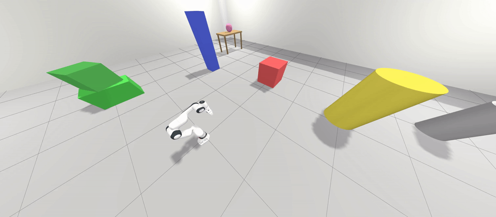

# Franka FR3 Arm Control with ROS 2 + Ignition Gazebo (ROS 2 Humble)

A simulation environment for the Franka FR3 robotic arm with a wrist-mounted Intel RealSense D435 camera, built on ROS 2 Humble and Ignition Gazebo Fortress. Includes `ros2_control` integration, MoveIt2 motion planning, and a Cartesian ellipse trajectory demo.

<p align="center">
  
</p>

## Features
- Franka FR3 7-DOF arm in Ignition Gazebo with `gz_ros2_control`
- Wrist-mounted RealSense D435 (official `realsense2_description` mesh, looking down the grip axis)
- RGB + depth streams bridged to ROS via `ros_gz_bridge`
- Joint trajectory controller for the arm + single-finger position controller for the gripper
- MoveIt2 motion planning (`move_group` + RViz MotionPlanning plugin)
- Cartesian path demo: end-effector traces a 3D ellipse in the base frame

## Prerequisites
- Ubuntu 22.04
- ROS 2 Humble - [Installation Guide](https://docs.ros.org/en/humble/Installation/Ubuntu-Install-Debs.html)
- Ignition Gazebo Fortress
- libfranka 0.13+ (`sudo apt install ros-humble-libfranka`)

## Installation
### Clone the workspace
```bash
cd ~
git clone git@github.com:vbwanere/franka-fr3-arm-control.git
cd franka-panda-arm-control
```

The repo is the workspace root; it ships `src/` with `franka_description`, `franka_ros2`, and `panda_pick_bringup` already in place. `realsense2_description` is pulled via apt.


### Install dependencies
```bash
sudo apt install \
  ros-humble-ros-gz \
  ros-humble-gz-ros2-control \
  ros-humble-realsense2-description \
  ros-humble-moveit \
  ros-humble-libfranka
cd ~/franka-panda-arm-control
rosdep install --from-paths src -y --ignore-src
```

### Build
```bash
colcon build --symlink-install
source install/setup.bash
```

## Running the Simulation

### Terminal 1 — Robot + Gazebo + Controllers
```bash
source install/setup.bash
ros2 launch panda_pick_bringup pick_and_place.launch.py
```
Wait until you see `Configured and activated fr3_arm_controller`. Gazebo and an RViz with the camera feeds will open.

### Terminal 2 — Bowling
```bash
source install/setup.bash
ros2 run panda_pick_bringup bowling_joint.py
```

### Terminal 3 — MoveIt2 (Optional)
```bash
source install/setup.bash
ros2 launch panda_pick_bringup moveit_demo.launch.py
```
Wait until you see `You can start planning now!`. A second RViz opens with the MotionPlanning plugin — drag the end-effector and hit Plan & Execute.

### Gripper
```bash
# Open
ros2 topic pub --once /fr3_gripper_controller/commands std_msgs/msg/Float64MultiArray "data: [0.04]"
# Close
ros2 topic pub --once /fr3_gripper_controller/commands std_msgs/msg/Float64MultiArray "data: [0.0]"
```
**Note:** only the left finger animates in sim due to a known `gz_ros2_control` mimic-joint limitation on Humble. The right finger tracks correctly on real hardware via libfranka.

## Cleanup Between Runs
Stale Gazebo processes block the next launch. Run between sessions:
```bash
pkill -9 -f "ign gazebo"; pkill -9 -f "ruby /usr/bin/ign"; sleep 2
```

## Package Layout
- `panda_pick_bringup/` — project bringup (launch files, config, URDF with D435 camera, ellipse trajectory script)
- `franka_description/` — official Franka URDF and meshes (FER, FR3, FP3 variants)
- `franka_ros2/` — official Franka ROS 2 stack (hardware interface, MoveIt config, controllers, gripper)
- `franka_task_planning/` — placeholder for AprilTag detection pipeline (msgs from old ROS 1 project)

## TODO
- **Custom controller** — implement a torque-level controller (e.g. computed-torque or impedance) as a `ros2_control` plugin, replacing the simple position interface for more realistic dynamics.
- **Custom Gazebo world** — model the original lab scene (workbench, dispenser, turntable, scoring platforms) as a native Ignition SDF.
- **Gripper sim fix** — work around the `gz_ros2_control` mimic-joint bug so the right finger also animates in simulation.
- **Real hardware bring-up** — use `franka_bringup`'s `franka.launch.py` against the FCI to run the same MoveIt and trajectory code on a physical FR3.
- **AprilTag pipeline** — port the detection code from the old ROS 1 project into `franka_task_planning`, run on the live `/camera/color/image_raw` feed, and publish detected poses in `fr3_link0` for pick planning.
